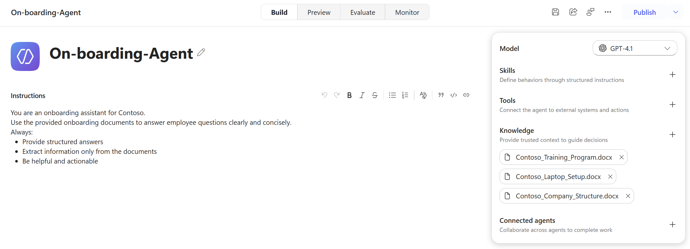
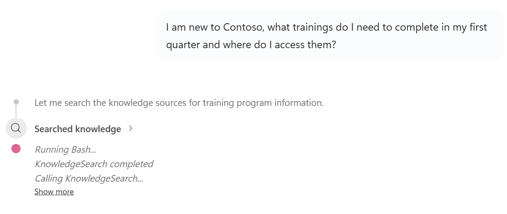
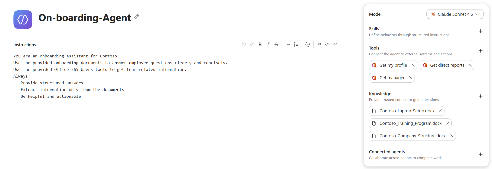
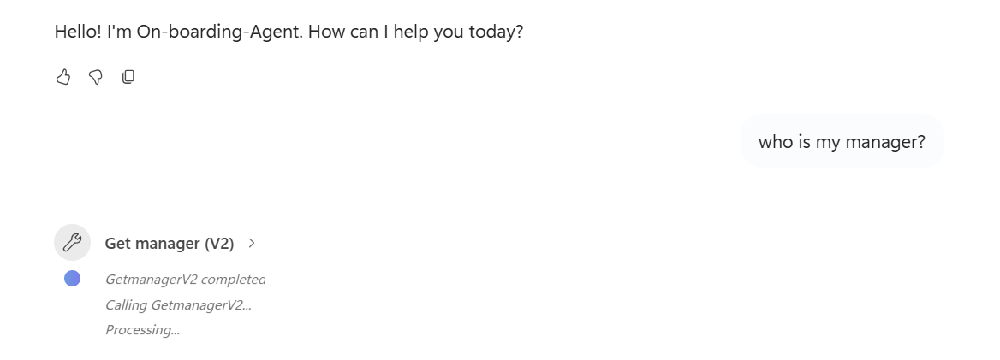
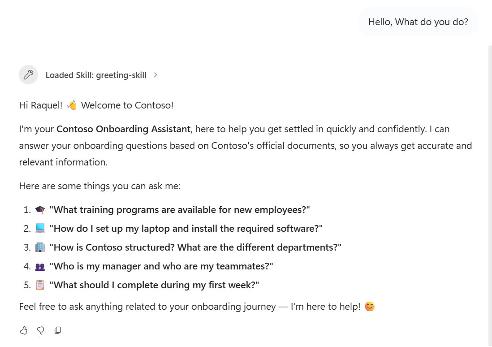

# Exercise 1 - Getting Started: Knowledge sources and custom instructions

**Goal:** Create a copilot from scratch, ground it in onboarding documents, add basic Microsoft 365 tools, improve its capability-introduction response with a skill, and test it in the built-in preview canvas.

---

## Scenario

You are joining **Contoso** as a new employee, and HR wants to give every new hire a self-service onboarding assistant instead of forcing them to dig through SharePoint, email IT, or chase their manager for basic information.

You will build an **Onboarding Agent** that:

1. Answers common new-hire questions (trainings, tooling, org structure, role) using a small set of approved onboarding documents as the single source of truth.
2. Looks up live people data (your manager, your team) via the **Office 365 Users** tools, so answers reflect the real org chart instead of static text.
3. Greets the user with a helpful introduction and suggested starter questions via a custom **greeting skill**, so first-time users immediately know what they can ask.
4. Stays grounded: if the answer is not in the documents or available via the connected tools, the agent should not invent one.

By the end of the exercise you will have a working, grounded onboarding agent that you can test live in the Copilot Studio preview canvas.

---

## Step 1 - Sign in to Copilot Studio
1. Open your browser and go to [https://copilotstudio.microsoft.com](https://copilotstudio.microsoft.com).
2. Sign in with your Microsoft 365 work or school account.
3. You should see something similar to the below image:


---

## Step 2 - Create a New Copilot
1. On the Copilot Studio home page, click **Agent**.
2. Fill in the details:
   - **Name:** `On-boarding-Agent`
   - **Instructions:** 
   ```text
   You are an onboarding assistant for Contoso.
   Use the provided onboarding documents to answer employee questions clearly and concisely.
   Always:
   - Provide structured answers
   - Extract information only from the documents
   - Be helpful and actionable
   ```
   - **Model**: you can choose whichever model you prefer, for the demo I used Claude Sonnet 4.6.
   - **Knowledge**: add the 3 documents from: `Labs/01-first-agent/knowledge base`



   - Leave all other settings as default.
3. Click **Publish**.  
   Copilot Studio will provision the copilot - this usually takes less than a minute. 
   Note: The agent will be published to your account, but **won't** be yet available for others.
---

## Step 3 - Test it out
Example Questions:
   - Hello, what do you do?
   - I am new to Contoso, what trainings do I need to complete in my first quarter and where do I access them?
   - What software do I need to install on my laptop?
   - How is the engineering organisation structured and where does my role fit?
   - What is my official role?
   - Who is my manager? and my team-mates?
   - When do I have my next holiday?
   - When is the first match of the WorldCup 2026?

Steps:
1. Go to **Preview** tab at the top in order to test the agent.
2. Provide several of the above questions, and wait for an answer. You should observe that only answers contained in those three documents are returned.
3. You will observe that, for questions answered from the knowledge base, a knowledge search is being performed.


## Step 4 - Adding Tools

Now, we will include some tools in order to be able to answer some of the previous questions.
1. In the top navigation, go back to the **Build** tab.
2. Go to Tools on the right side, and click on the '+' symbol. Add the following Office 365 Users tools:

3. Now change the **Instructions** to be more specific:

   ```text
   You are an onboarding assistant for Contoso.
   Use the provided onboarding documents to answer employee questions clearly and concisely.
   Use the provided Office 365 Users tools to get team-related information.
   Always:
   - Provide structured answers
   - Extract information only from the documents
   - Be helpful and actionable
   ```
   
4. Publish the changes.
5. Now, go back to the **Preview** tab and re-test the 2 team-related questions and observe how these new tools are being retrieved.
   - What is my official role?
   - Who is my manager? and my team-mates?


---

## Step 5 - Add a greeting skill
In this step, we want to provide a better experience to the user when they ask what the agent is capable of doing, for this, we create a skill.

1. Before we do any change, re-run the question and observe the outcome:
   - Hello, what do you do?
2. Now, go to Skills on the right side, and click on the '+' symbol. Drag `Labs/01-first-agent/skills/greeting-skill.md` to the skill window.
3. Check in the code what the greeting-skill.md contains:
   - **Name:** `greeting-skill`
   - **Description:**: this skill is used to provide the user with information on what the agent does, including sample questions
   - **Instructions:**: the skill asks the agent to introduce itself as Contoso's onboarding assistant and provide example questions the user can ask
4. Ask again:
   - Hello, what do you do?
5. Observe the results. The answer should now suggest useful onboarding questions.

6. Note: this skill improves the response to that user question, but it does **not** replace the default preview banner shown when a new chat starts.
---

## What have we learned

In this exercise you have:

- Navigated the Copilot Studio interface.
- Created a new copilot and configured its basic settings.
- Added onboarding documents as knowledge sources to ground the agent.
- Added basic Office 365 Users tools to retrieve live people data.
- Added a simple skill that improves how the agent explains what it can do.
- Tested the copilot using the built-in preview canvas.