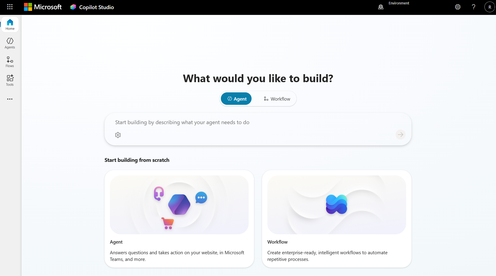
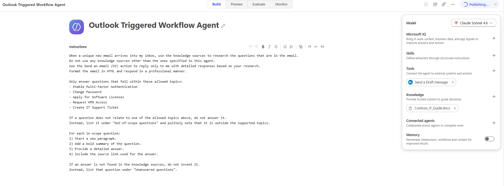
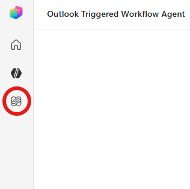
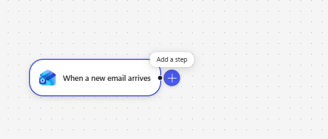
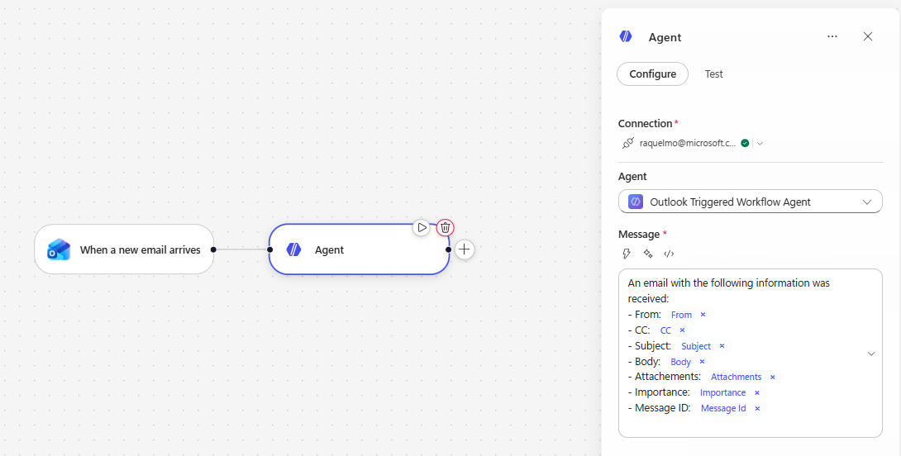
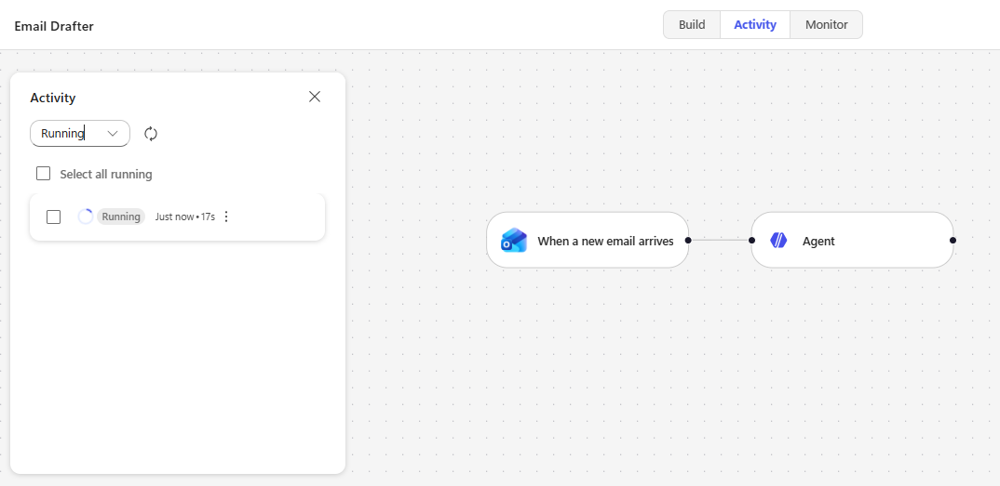
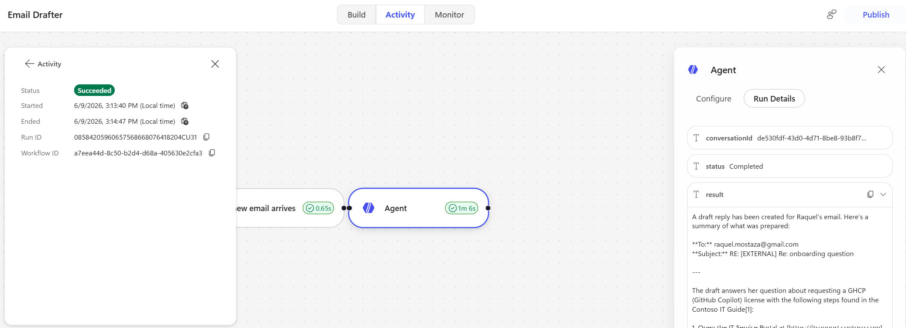
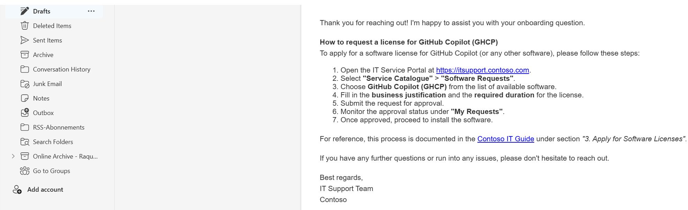

# Exercise 2 - Outlook Triggered Workflow Agent

**Goal:** Build an Outlook-triggered agent that reads new emails, answers questions using approved knowledge sources, and drafts a professional HTML reply automatically.

---

## Scenario

You work at **Contoso's IT helpdesk**, where the team is flooded with repetitive employee emails about MFA, password resets, software licenses, VPN access, and support tickets — even though all the answers already live in the IT knowledge base.

You will build an **Outlook Triggered Workflow Agent** that:

1. Starts automatically when a new email arrives, using an event-based Copilot Studio trigger.
2. Answers only questions within the supported IT topics, using the approved IT knowledge document as the single source of truth.
3. Drafts a professional HTML reply in your **Drafts** folder via the **Draft an email message** action, so you can review it before sending.
4. Stays grounded: out-of-scope or unanswerable questions are listed under "Unanswered questions" instead of being made up.

By the end of the exercise you will have a working email-triage agent that turns inbound IT questions into review-ready draft replies.

---

## Step 1 - Sign in to Copilot Studio
1. Open your browser and go to [https://copilotstudio.microsoft.com](https://copilotstudio.microsoft.com).
2. Sign in with your Microsoft 365 work or school account.
3. You should see something similar to the below image:



---

## Step 2 - Create the Agent

1. On the Copilot Studio home page, click **Agent**.
2. Set:
   - **Name:** `Outlook Triggered Workflow Agent`
   - **Instructions:**
      ```text
      When a new email arrives into my inbox, and it is sent by an individual (not by a group or generic email), use the knowledge sources to research the questions that are in the email.
      Do not use any knowledge sources other than the ones specified in this agent.

      Only answer questions that fall within these allowed topics:
      - Enable Multi-Factor Authentication
      - Change Password
      - Apply for Software Licenses
      - Request VPN Access
      - Create IT Support Ticket

      For each in-scope question:
      - Start a new paragraph.
      - Add a bold summary of the question.
      - Provide a detailed answer.
      - Include the source link used for the answer.

      Use the `Draft an email message` tool to create a draft message with detailed responses based on your research. Format the email in HTML and respond in a professional manner.

      Decision rules:
      - If at least one question is in-scope and answerable from the knowledge sources, draft the email. List any questions you could not answer under a final section titled "Unanswered questions".
      - If none of the questions are in-scope or answerable from the knowledge sources, do not draft an email response.
      ```
   - **Model**: you can choose whichever model you prefer, for the demo I used Claude Sonnet 4.6.
   - **Knowledge**: add the 1 document from: `Labs/02-email-triggered-agent/knowledge base`
---

## Step 3 - Add the Email Action Tool

1. In the **Tools** section, click on the symbol **+**.
2. Select the Outlook connector action **Draft an email message**.
3. Complete connector sign-in if prompted.
4. Confirm the tool appears under Tools.
5. Publish the agent.

---

## Step 4 - Add the Outlook Trigger Workflow

1. Navigate to the **Workflow** section (see image below):



2. Click on **New Workflow** and call it "Email Drafter"
3. On the right panel, click on trigger type and select **Connector**. Select **When a new email arrives**.
4. Configure basic trigger settings:
   - Mailbox folder: `Inbox`
   - For testing purposes we can add **From** and add our personal email.
5. Click on **Add a step**



6. Select the recently created agent (i.e. **Outlook Triggered Workflow Agent**), and add the below message. Make sure to replace each `#token` with the corresponding dynamic content from the trigger:
   ``` text
   An email with the following information was received:
   - From: #From
   - CC: #CC
   - Subject: #Subject
   - Body: #Body
   - Attachments: #Attachments
   - Importance: #Importance
   - Message ID: #MessageID
   ```
   
7. Publish the workflow by clicking on **Publish**.
---

## Step 5 - Test and Validate

1. Send a test email to yourself with a subject like `Onboarding questions`. Make sure you send the email from the same email address provided in the trigger filter in Step 4.
2. Include a few questions in the body, for example:
   - `How can I request a license for GHCP?`
   - `How can I set up MAF?`
3. Wait for the trigger to fire and the agent to run. To verify that the trigger fired, go to the **Activity** tab within the workflow and verify the record appears.

4. Once the activity has run, click on the specific activity to see more details. You can also click on the different steps to inspect the input/output for each step.

5. **Expected result:** A professional and structured draft message has been saved in your `Drafts` folder in Outlook.


Validation checklist:
- Answers are grounded in your configured knowledge only.
- Each in-scope question has a detailed, structured section.
- Out-of-scope or unanswerable questions are listed under **Unanswered questions**.

---

## What have we learned

In this exercise you have:

- Configured an event-based trigger in Copilot Studio using **When a new email arrives**.
- Added and used the **Draft an email message** tool action.
- Restricted the agent's responses to approved knowledge sources and a defined set of topics.
- Tested an automated email-response workflow end to end.

